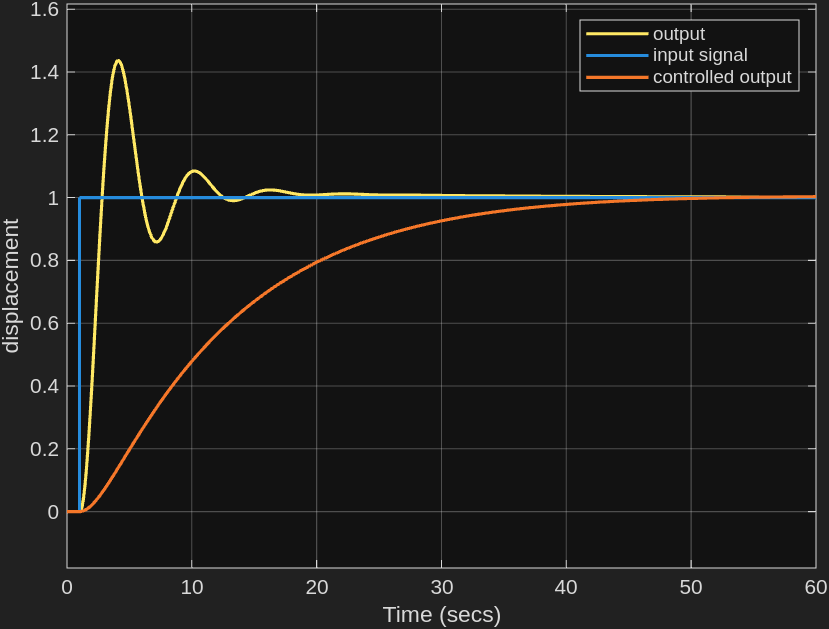
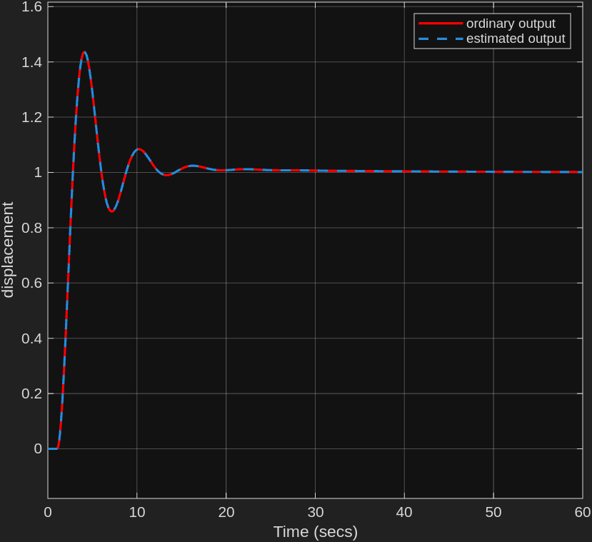

# automobile-suspension-state-space-control

## Overview
This project involved the modelling and control or an automobile suspension system using MATLAB and Simulink. 
Using a simplified version of the suspension system (provided by lecturer), the system was mathematically modelled by Newton-Euler and Lagrangian methods.
In confirmation, further visual modelling by bond graph, block diagram and system loop was done.

The State-space model was done in MATLAB with both controllability canonic form and Ackermann formula. In Simulink, the model was visualised
with a full-state-feedback-control model and state-observer model.The modelling in MATLAB and Simulink were different for the front and rear of the automobile.

An approximation of a standard of a speed-bump and a random pothole scenario were modelled in simulink.

## Modelling diagrams

## Simulation Results
For the front suspension system system,

### Control Response

### Observation Response

## Source Files

The repository contains:

- MATLAB scripts for front and rear suspension modelling and simulation.
- Simulink models for control and observation scenarios.
- System modelling diagrams.
- Simulation results.

## Project Information

**Author:** Edidiong Enobong Umoh

**Institution:** University of Debrecen

**Project Type:** Academic Control Engineering Project

**Software:** MATLAB, Simulink

**System:** Automobile Suspension System

**Modelling Approaches:** Newton-Euler Modelling, Lagrangian Modelling, Bond Graph Modelling

**Control Method:** State-Space Control

## License

Documentation, images, diagrams, and other non-code materials are licensed under the Creative Commons Attribution-NonCommercial-NoDerivatives 4.0 International License.

Source code is licensed under the MIT License.

See:
- `LICENSE` for documentation and media licensing.
- `LICENSE-CODE` for source code licensing.
